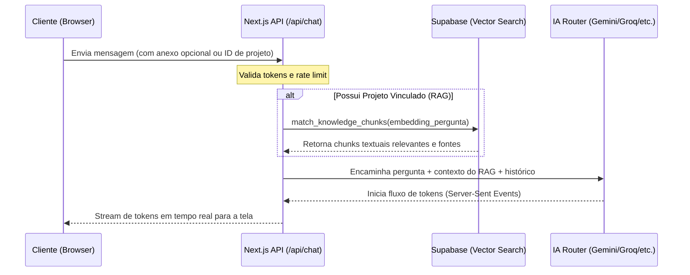

# Documentação Técnica e Operacional do Truqpedia

Esta documentação fornece uma visão aprofundada da arquitetura, fluxo de execução, sistema de RAG (Retrieval-Augmented Generation), rotas de IA com fallback, modelo de dados, decisões de design responsivo e validação do sistema Truqpedia.

---

## 📖 1. Visão Geral e Propósito Comercial

O **Truqpedia** é um assistente técnico inteligente voltado para a indústria de autopeças de veículos pesados (caminhões, carretas, ônibus). Ele foi desenhado para resolver problemas diários enfrentados por balconistas, mecânicos, compradores e estoquistas:
- **Redução de Devoluções**: Validação técnica de aplicações de peças por meio do código do chassi ou dados comparativos de catálogos.
- **Equivalência Ágil**: Comparação e correspondência entre códigos de fabricantes diferentes de forma segura.
- **Anúncios e Orçamentos**: Geração rápida de descrições técnicas para marketplaces e mensagens prontas para WhatsApp.

---

## 🏗️ 2. Arquitetura do Sistema e Fluxo de Execução

O Truqpedia é construído sobre o ecossistema do **Next.js (App Router)** com banco de dados **Supabase** e integração com múltiplos provedores de Modelos de Linguagem (LLMs).

### Fluxo de Execução de Atendimento (Chat)


1. **Carregamento Server-Side**: O arquivo [page.tsx](file:///c:/Users/user/Documents/GitHub/truckpedia/src/app/chat/page.tsx) resolve a autenticação no Supabase via SSR e recupera o histórico recente de conversas e coleções (projetos) do usuário antes de renderizar a casca principal.
2. **Envio da Pergunta**: O chat composer no frontend captura o texto e possíveis arquivos anexos temporários. Se o atendimento estiver sob um "Projeto", a requisição inclui o `projectId`.
3. **Pesquisa Vetorial Híbrida**: Caso haja um `projectId`, o backend gera o embedding da consulta do usuário usando o modelo `text-embedding-004` da Gemini API e consulta a função SQL `match_knowledge_chunks` para obter peças e equivalências.
4. **Router de IA com Fallback**: O endpoint `/api/chat` invoca a função `streamWithFallback` que tenta se conectar aos provedores configurados (ex: Gemini, Groq, OpenRouter) em ordem de prioridade. Se o principal falhar, o roteador chaveia instantaneamente para o secundário de forma transparente para o usuário.
5. **Retorno em Tempo Real**: Os tokens de resposta e as fontes RAG são enviados ao cliente via stream SSE (Server-Sent Events).

---

## 🧠 3. Mecanismo de RAG (Indexação e Busca Vetorial)

O sistema de RAG do Truqpedia permite contextualizar a inteligência artificial utilizando manuais e tabelas técnicas em PDF, Excel ou CSV.

### Fluxo de Processamento de Arquivos
1. **Upload para Storage**: Os arquivos são enviados diretamente via cliente para o bucket privado `document-assets` no Supabase Storage.
2. **Fila de Extração**: O endpoint `/api/projects/[id]/process` inicia o parseamento do documento no [rag-worker.ts](file:///c:/Users/user/Documents/GitHub/truckpedia/src/lib/ai/rag-worker.ts).
   - **Arquivos PDF**: Utiliza a classe `PDFParse` para carregar o binário e extrair os blocos de texto por página.
   - **Planilhas (Excel/CSV)**: Utiliza a biblioteca `xlsx` para varrer as planilhas e converter linha a linha em chaves estruturadas no formato: `Catálogo: [Nome] | Linha X: [Campo1: Valor1] [Campo2: Valor2]`.
3. **Divisão de Texto (Chunking)**:
   - Para textos corridos (PDFs), aplica-se um divisor recursivo de caracteres de **1.000 caracteres** com **200 de sobreposição (overlap)**.
   - Para tabelas, cada linha constitui um bloco individual (para evitar a perda de correlação de colunas).
4. **Geração de Embeddings**: Chunks são enviados em lotes (batch) para a API do Gemini gerando vetores de **768 dimensões** (`text-embedding-004`).
5. **Busca Híbrida**: No momento da busca, a função customizada `match_knowledge_chunks` calcula a distância cosseno dos embeddings e executa um filtro `ILIKE` no conteúdo textual. Correspondências exatas de palavras-chave (como códigos de peças) recebem um multiplicador de relevância de `1.5` sobre a similaridade semântica.

---

## 🗄️ 4. Modelo de Dados e Segurança (RLS)

O banco de dados PostgreSQL utiliza esquemas estritos com políticas de **Row-Level Security (RLS)** para garantir o isolamento operacional de cada cliente.

### Principais Tabelas
- `user_profiles`: Guarda informações do perfil do usuário e cargo (ex: `admin`, `user`).
- `user_settings`: Guarda preferências específicas de metadados.
- `conversations`: Guarda cabeçalhos de atendimentos.
- `messages`: Guarda o histórico de chats, referências e metadados.
- `knowledge_collections`: Representa os "Projetos" criados pelos usuários.
- `document_assets`: Associa arquivos físicos do RAG a um projeto.
- `knowledge_chunks`: Guarda os chunks textuais e a coluna `embedding` do tipo `vector(768)`.

### Políticas de RLS Críticas
Todas as tabelas que contêm dados do usuário (como conversas, projetos e chunks) possuem a RLS ativa:
```sql
alter table public.conversations enable row level security;
create policy "Users can modify their own conversations"
  on public.conversations for all
  using (auth.uid() = user_id);
```
O storage segue as mesmas políticas de segurança, isolando pastas com o ID do usuário no bucket `document-assets`.

---

## 📱 5. UI/UX e Responsividade de Layout

Toda a interface do Truqpedia foi desenhada para se adaptar perfeitamente a dispositivos móveis (balcão da oficina) e computadores desktop.

### 1. Barra Lateral de Navegação (Sidebar)
- **Celular/Tablet (< 768px)**: Inicializa de forma **recolhida** para evitar cobrir a tela no carregamento. O usuário pode deslizar ou clicar no menu hambúrguer para abrir.
- **Desktop (>= 768px)**: Fixa na lateral esquerda de forma estática para facilitar a navegação ágil entre projetos e conversas.

### 2. Painel de Documentos (Artifacts)
- **Split-Screen no Desktop (>= 1024px)**: Quando aberto, o painel do documento divide o espaço físico da tela de forma compartilhada. A área de chat diminui sua largura automaticamente para acomodar o documento ao lado sem sobrepor as mensagens.
- **Gaveta no Mobile/Tablet (< 1024px)**: Desliza por cima do chat. Possui um **dimmer backdrop** escuro (`bg-black/40`) sob ele, permitindo fechar o painel ao clicar em qualquer área vazia fora do documento.

### 3. Tabelas Markdown e Mensagens
- As tabelas e listas complexas retornadas pela IA são envolvidas em um contêiner com rolagem horizontal suave (`overflow-x-auto w-full border rounded-lg bg-card/40 shadow-sm`), prevenindo o estouro lateral da viewport em telas estreitas de smartphones.

---

## 🛠️ 6. Organização de Código e Modularidade

O arquivo gigante `truqpedia-shell.tsx` foi refatorado em componentes limpos e fortemente tipados na pasta `src/components/chat`:

- **[types.ts](file:///c:/Users/user/Documents/GitHub/truckpedia/src/components/chat/types.ts)**: Reúne todas as definições e interfaces TypeScript locais.
- **[conversation-dialogs.tsx](file:///c:/Users/user/Documents/GitHub/truckpedia/src/components/chat/conversation-dialogs.tsx)**: Modais para renomeação e exclusão de conversas.
- **[project-dialogs.tsx](file:///c:/Users/user/Documents/GitHub/truckpedia/src/components/chat/project-dialogs.tsx)**: Modais de criação de projetos e edição de preferências do assistente.
- **[project-files-dialog.tsx](file:///c:/Users/user/Documents/GitHub/truckpedia/src/components/chat/project-files-dialog.tsx)**: Interface de gerenciamento e upload de manuais do RAG.
- **[artifact-panel.tsx](file:///c:/Users/user/Documents/GitHub/truckpedia/src/components/chat/artifact-panel.tsx)**: Lógica visual do painel split-screen de documentos.
- **[message-bubble.tsx](file:///c:/Users/user/Documents/GitHub/truckpedia/src/components/chat/message-bubble.tsx)**: Bolhas de mensagem do chat, timeline de atividades e cartões de fontes.

---

## 🧪 7. Estrutura de Testes e CI/CD

O projeto conta com suítes de teste de integração e unitários, além de checagens automatizadas de consistência:

- **Testes de Lógica e Utilitários (Vitest)**:
  - `src/lib/rate-limit.test.ts`: Testa limitadores de taxa de requisições.
  - `src/lib/ai/intent.test.ts`: Valida a classificação de intenção técnica baseada na mensagem do cliente.
  - `src/lib/ai/memory.test.ts`: Testa o gerenciamento de histórico na memória da IA.
  - `src/lib/ai/rag-worker.test.ts`: Garante o split recursivo correto e o parseamento de linhas Excel.
  - `src/lib/search/web-search.test.ts`: Garante o parse de respostas de motores de busca.
- **Verificação do CI**:
  Para garantir estabilidade pré-deploy, o pipeline realiza:
  ```bash
  npm run lint       # Valida boas práticas e estilos de código (ESLint)
  npm run typecheck  # Compila os tipos TypeScript do projeto
  npm run test       # Roda todos os testes unitários via Vitest
  npm run build      # Faz o build estático otimizado de produção
  ```
